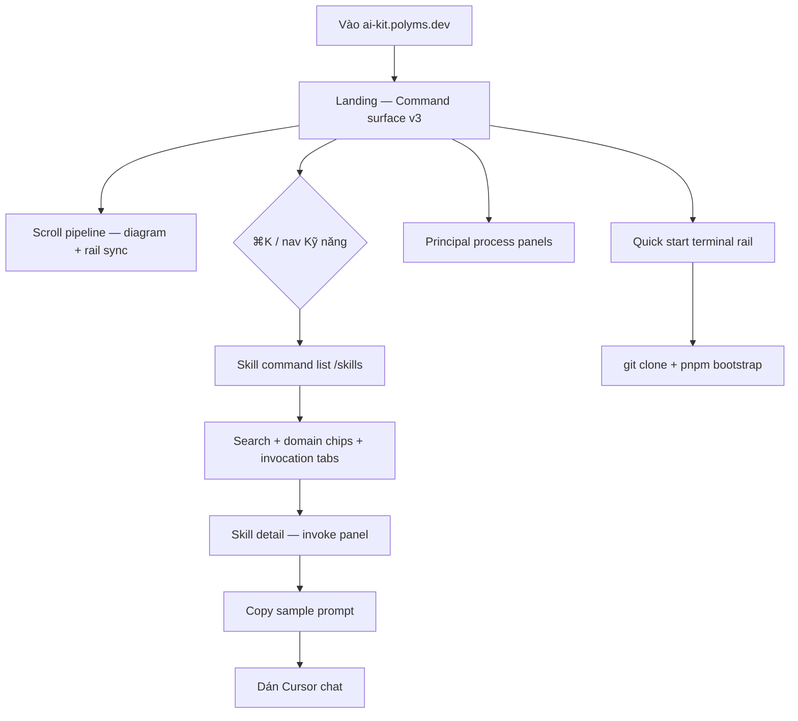

# Design Spec: Kit site — Landing page (Command surface v3)

Output path: `docs/design/ai-kit-landing.md`

**Related:** [PRD v1.1](../prd/ai-kit-landing.md) · [ADR-0002](../adr/0002-kit-site-static-vite-core-ui.md) · [CONTEXT.md](../../CONTEXT.md)

> **v3 (2026-07-04):** Overwrite composition layer từ v2. **Giữ 100%** routes, PRD §6.3 content checklist, overlay shape, Umami events, locale/theme stores. **Thay:** hero wireframe theo breakpoint, principles bento grid maps, pipeline = **diagram canvas + rail + single detail swap** (không 12× `min-h-[70vh]` text void). Visual reference: [tasteskill.dev](https://www.tasteskill.dev/) craft tier — không copy brand.

---

## 0. Redesign audit — Intent vs Shipped vs Fix (v3)

| Area                  | Intent (PRD §6 + ADR)                                      | Shipped (`apps/landing/`)                                                                                                                              | Fix (v3 — bắt buộc `/dev`)                                                                                                                                             |
| --------------------- | ---------------------------------------------------------- | ------------------------------------------------------------------------------------------------------------------------------------------------------ | ---------------------------------------------------------------------------------------------------------------------------------------------------------------------- |
| **Theme first paint** | Dark default; light toggle; ADR §9                         | `readStoredTheme()` respects `prefers-color-scheme: light` → light on first visit; **no inline flash script** in `index.html`                          | Inline `<script>` in `index.html` set `class="dark"` before paint; hydrate Zustand after; light only via toggle or saved pref                                          |
| **Mood / density**    | Engineering artifact — tasteskill.dev craft tier           | Flat doc: equal borders, weak hierarchy, page reads as unstyled README                                                                                 | Full-bleed rhythm; 3-level type scale visible; section surface alternation; **dark acceptance screenshots**                                                            |
| **Hero**              | Asymmetric cascade + terminal; one focal beat              | Grid OK at `lg` but content feels centered in `page-x`; terminal competes weakly                                                                       | Exact % splits §3.0; terminal **compact trên mobile** (stack dưới copy, không hide); `pt` clears fixed header                                                          |
| **Principles bento**  | 1 hero cell + 4 compact; `gap-px bg-line` grid lines       | `grid-cols-2` + `row-span-2` on #1 **without explicit placement** → numbers `text-line` float, grid lines invisible on light, auto-flow breaks at `md` | Explicit `grid-template` + `grid-area` per breakpoint §3.1; numbers `text-primary-700/15` not `text-line`                                                              |
| **Pipeline**          | Living diagram + scroll activation; triage dashed parallel | 12× `min-h-[70vh]` panels — one title + paragraph centered in void (**ANTI-SLOP §A**)                                                                  | **`PipelineDiagram` canvas** + sticky rail; **one `StageDetailPanel`** swaps content; scroll section height = `stages × 40vh` driver divs hidden, not 12 visible walls |
| **Rail / IO**         | Scroll-scrub + hover; `pipeline_section_view`              | Rail OK desktop; IO on 12 tall panels → jittery active state                                                                                           | IO on **scroll driver** segments; rail + diagram node sync; events unchanged                                                                                           |
| **Catalog / palette** | Command palette density                                    | Raw input patterns partially fixed                                                                                                                     | core-ui `Field.Control`, `Modal`; `>` prefix rows                                                                                                                      |
| **core-ui map**       | Dogfood primitives                                         | Mixed raw HTML                                                                                                                                         | §5 — **Modal** not Dialog; **Field.Control** not Input                                                                                                                 |

### Preservation rules (không đổi)

- Routes: `/`, `/skills`, `/skills/:invoke`, `/skills/:invoke` detail, `/#quick-start`, `/quick-start` → redirect `/#quick-start`
- 12 skills catalog, 11 sample prompts + arch model hint, pipeline nodes (main + triage), 4 principal agents, 5 principles full list
- Quick start blocks, copy clipboard + toast, locale VI/EN, theme dark/light, overlay TS shape
- Umami: `copy_prompt`, `pipeline_section_view`, `cta_quick_start`, `theme_toggle`, `command_palette_open`
- TanStack Router search params; Zustand `useUiStore`; WCAG 2.1 AA; four states per screen

### Implementation priority (cho `/dev`)

| Order  | Slice                                                                              | Why                                           |
| ------ | ---------------------------------------------------------------------------------- | --------------------------------------------- |
| **P0** | Dark-first flash script + `globals.css` type scale + break centered-container trap | First paint + every section depends on tokens |
| **P0** | Hero composition §3.0 + `HeroTerminalStrip` (mobile visible, header clearance)     | Bounce decision in 3s                         |
| **P0** | `PipelineDiagram` + rail + **single** `StageDetailPanel` scroll-scrub              | Core differentiation; fixes §A wall-of-void   |
| **P1** | `PrinciplesBento` explicit grid maps §3.1                                          | Shipped bento broken at `grid-cols-2`         |
| **P1** | `SkillCommandList` + `CommandPalette` → core-ui Modal / Field.Control              | Discovery path                                |
| **P2** | `PrincipalPanels` process bento + `TerminalSection` quick start                    | Content OK, chrome weak                       |
| **P2** | `SkillDetailPage` invoke tab + `TerminalPromptBlock`                               | Copy conversion                               |
| **P3** | Motion polish, catalog keyboard nav, search highlight                              | Should-have engagement                        |

---

## 1. Brief

### BRIEF-INFERENCE table (mandatory)

| Dimension          | Question                        | Kit site answer                                                                                                   |
| ------------------ | ------------------------------- | ----------------------------------------------------------------------------------------------------------------- |
| **Industry**       | What world is the user in?      | Developer tools — Cursor agent skills, Polyms pipeline                                                            |
| **Audience**       | Who judges "good" in 3 seconds? | Senior fullstack / tech lead — anti-marketing, slash-command native                                               |
| **Mood**           | One adjective + anti-mood       | **Command surface, IDE-adjacent** — not calm editorial, not SaaS brochure                                         |
| **Motion depth**   | subtle / standard / emphasis    | Standard: hero typewriter + pipeline scroll-scrub; subtle elsewhere                                               |
| **Layout family**  | Primary family                  | Asymmetric split hero + sticky rail scrollytelling with **diagram canvas** — not centered hero + 3-col features   |
| **Focal moment**   | One viewport = one hero beat    | **Hero:** typographic cascade dominates left 62%; terminal strip supports right 38% — not competing equal columns |
| **Density**        | sparse / balanced / dense       | **Balanced-dense** — information-rich; whitespace carries structure (grid lines, diagram), not emptiness          |
| **Theme default**  | dark-first / light-first        | **Dark-first** (ADR-0002 §9); light toggle AA-safe via core-ui semantic tokens                                    |
| **Reference tier** | Craft URLs                      | Primary: [tasteskill.dev](https://www.tasteskill.dev/) — density, hero drama, section rhythm                      |

### Brief lock

Kit site là **terminal của pipeline** — README nâng cấp thành interactive surface cho kỹ sư Cursor. Success = user biết **lệnh chạy tiếp** trong 2 phút: scroll pipeline thấy artifact flow, ⌘K mở catalog, copy prompt, bootstrap. v3 khóa **composition measurable**: hero % splits, bento grid-area per breakpoint, pipeline **diagram + one detail panel** thay vì 12 text walls. Dogfood `@polyms/core-ui`; dark theme là acceptance default.

### §1b Quality bar

Per [QUALITY-BAR.md](../../skills/design/QUALITY-BAR.md) — finished-site tier, not wireframe boxes.

| Dimension        | Kit site bar                                                                                                                            |
| ---------------- | --------------------------------------------------------------------------------------------------------------------------------------- |
| **Completeness** | Every route end-to-end: token/CSS intent in §4 — no gray placeholders, no README pasted as unstyled markdown                            |
| **core-ui**      | §5 + §17 — `Modal`, `Field.Control`, `Button` variants; cấm raw `<input>`, Dialog alias, ad-hoc locale buttons where `ToggleGroup` fits |
| **Composition**  | Measurable splits §3.0–§3.3; diagram canvas + rail; bento `grid-area`; type scale §4.1 — reads **designed**, not template slop          |
| **Content**      | PRD §6.3 locked — overlay keys + §15 checklist; copy from README/CONTEXT, không marketing fluff                                         |

- **Visual reference:** [tasteskill.dev](https://www.tasteskill.dev/) — hero density, asymmetric split, section rhythm, dark craft tier. **Do not** copy brand, skill grid, or sponsor strip (PRD §6.6 #3).
- **Craft intent:** Full-bleed landing với **surface alternation** (`bg-body` / `bg-surface-2`), **1px `border-line` section seams**, **border-s-4 accent** on active panels — not uniform `rounded-xl` cards. Invoke mono **largest in row**. Pipeline diagram nodes có **active ring + hover lift**; detail panel compact (`min-h 240px`). Dark-first acceptance screenshots; light toggle AA-safe via core-ui semantic tokens only. `/dev` ships CSS classes from §4 — not “we’ll polish later.”

| Field          | Value                                                                                   |
| -------------- | --------------------------------------------------------------------------------------- |
| Persona        | Kỹ sư fullstack / tech lead Polyms — Cursor daily, dark theme                           |
| Job to be done | Hiểu pipeline; browse/copy prompt; bootstrap — **biết invoke tiếp theo**                |
| Mood / layout  | Command surface v3 — terminal + pipeline diagram (PRD §6.1)                             |
| Theme preset   | core-ui dark default + light toggle; `localStorage` `ai-kit-theme`; inline flash script |

**Visual reference detail** — see §1b borrow/avoid table:

| Element         | Borrow                                                     | Apply on ai-kit                                                                        |
| --------------- | ---------------------------------------------------------- | -------------------------------------------------------------------------------------- |
| Hero type scale | Display H1 dominates viewport top-half; subcopy restrained | `.display` 40→48→64px; accent line `text-primary-700`                                  |
| Asymmetry       | Content weighted left; visual anchor right                 | 62/38 hero split `lg+`; terminal strip not centered card                               |
| Section rhythm  | Full-bleed dark bands alternate with constrained content   | Landing `page-x` full width; catalog `max-w-4xl`; `border-b border-line` every section |
| CTA weight      | Primary button solid; secondary text/mono link             | `Button primary lg` + `font-invoke` text link                                          |
| Density         | Sections feel **designed full** — no 80vh empty            | Pipeline diagram fills panel; detail panel compact                                     |

**Do NOT borrow:** skill grid, sponsor strip, brand colors, infinite marquee, light-gray editorial default.

---

## 2. Flows

### Primary flow — Khám phá và bootstrap



### Critical paths

- **Onboarding:** Landing → pipeline dwell (≥8s) → Quick start → copy bootstrap.
- **Skill discovery:** `⌘K` → filter → Enter → copy prompt.
- **Pipeline deep link:** Diagram node or rail item → `/skills/:invoke` (trừ Idea, ship, ready-for-agent).
- **Triage branch:** Dashed path on diagram + rail — always visible, not tooltip-only.
- **Locale:** Toggle EN — chrome only; prompts bilingual.
- **Error:** Alert + retry; copy fail → toast + `select()` on `<pre>`.

---

## 3. Screen inventory

### Global chrome (Site shell)

| Field | Value                                               |
| ----- | --------------------------------------------------- |
| Goal  | Nav tối thiểu, ⌘K, theme, locale, status-line brand |
| Entry | Mọi route                                           |
| Exit  | Routes, palette, external GitHub                    |

**States:**

| State   | User sees                            | Action                 |
| ------- | ------------------------------------ | ---------------------- |
| Loading | Header skeleton `h-14`               | —                      |
| Empty   | N/A                                  | —                      |
| Error   | Alert «Không tải được cấu hình site» | Reload                 |
| Success | Fixed header + palette trigger       | Nav, ⌘K, theme, locale |

**Layout — status-line header:**

```
┌─ fixed h-14 z-50 — bg-body/95 backdrop-blur border-b border-line ────────────┐
│ ai-kit          Kỹ năng   Bắt đầu nhanh          [⌘K] [☀/☾] [VI|EN]  GitHub ↗ │
│ font-invoke     Link      Link                     sm    icon  ToggleGroup      │
│ text-lg bold                                                                    │
└─────────────────────────────────────────────────────────────────────────────────┘
```

- **Width:** full viewport — `px-4 md:px-8`; **cấm** `max-w-6xl mx-auto` on header.
- **Main clearance:** `#main` `scroll-mt-14` (or `pt-14` on first section) — **cấm** hero text under header.
- **⌘K:** `Button variant="ghost" size="sm"` + `font-invoke`; `Meta+K` global → `command_palette_open`.
- **Theme:** toggle → `theme_toggle`; default dark via inline script (§4.6).
- **Locale:** `ToggleGroup` VI \| EN — §17; not raw button group.
- **Skip link:** `#main` sr-only focusable.

---

### Landing page (`/`)

| Field | Value                                                                               |
| ----- | ----------------------------------------------------------------------------------- |
| Goal  | Hook typographic, pipeline diagram, principles bento, principals, teaser, bootstrap |
| Entry | `/`, logo, catalog back                                                             |
| Exit  | `/skills`, `/#quick-start`, `/skills/:invoke`, palette                              |

**States:**

| State   | User sees                                 | Action                          |
| ------- | ----------------------------------------- | ------------------------------- |
| Loading | Hero skeleton + diagram placeholder       | Scroll                          |
| Empty   | N/A                                       | —                               |
| Error   | Alert «Không tải được nội dung trang chủ» | Retry, GitHub                   |
| Success | Full landing                              | Scroll, ⌘K, CTAs, diagram nodes |

---

### §3.0 Hero composition + reference

**Focal beat:** User sees **one** dominant typographic stack (lines 1–2 display scale) before scroll; terminal strip is secondary anchor — smaller type, right/below.

#### Wireframe — percent widths per breakpoint

**`<768px` (default mobile) — stack, 100% width each row**

```
┌─ HERO — page-x pt-14 pb-12 border-b border-line — 100% viewport width ────────┐
│ ROW 1 — COPY — width 100%                                                     │
│   .display (40px) — «Kỹ năng agent»                                           │
│   .display .text-primary-700 — «cho real engineering»                         │
│   p.text-lg.text-muted.mt-3 — sub (max-width 36ch)                            │
│   flex gap-4 mt-8 — Button primary full-width sm:auto + link secondary        │
│                                                                               │
│ ROW 2 — TERMINAL — width 100%, mt-8 (VISIBLE — not hidden)                    │
│   compact: p-4, text-sm mono, max 3 lines visible                             │
│   polyms/ai-kit + cursor | > /align (typewriter)                              │
└───────────────────────────────────────────────────────────────────────────────┘
```

| Zone               | Width                   | Notes                                       |
| ------------------ | ----------------------- | ------------------------------------------- |
| Copy block         | **100%**                | Left-aligned; **cấm** `mx-auto text-center` |
| Terminal strip     | **100%**                | Below CTAs; `aria-hidden="true"` decorative |
| Horizontal padding | `px-4` (16px each side) | Full-bleed section, not `max-w-6xl`         |

**`768–1023px` (md tablet) — 60/40 split**

```
┌─ HERO — page-x pt-16 pb-16 ──────────────────────────────────────────────────┐
│ grid md:grid-cols-[minmax(0,60%)_minmax(0,40%)] gap-6 items-end               │
│ LEFT 60%                          │ RIGHT 40%                                 │
│ .display md:text-5xl (48px)       │ Terminal strip md:p-5                     │
│ sub + CTAs                        │ typewriter visible                        │
└───────────────────────────────────┴───────────────────────────────────────────┘
```

| Zone     | Width          | Notes                                                   |
| -------- | -------------- | ------------------------------------------------------- |
| Copy     | **60%**        | `minmax(0,60%)`                                         |
| Terminal | **40%**        | Align `items-end` — terminal bottom aligns CTA baseline |
| Gap      | 24px (`gap-6`) |                                                         |

**`≥1024px` (lg desktop) — 62/38 split**

```
┌─ HERO — page-x pt-16 pb-20 lg:px-12 ─────────────────────────────────────────┐
│ grid lg:grid-cols-[minmax(0,62%)_minmax(0,38%)] gap-12 items-end               │
│ LEFT 62%                                    │ RIGHT 38%                        │
│ .display lg:text-6xl (64px)                 │ Terminal lg:p-6                  │
│ line 2 accent                               │ 4 invoke lines, active glow      │
│ sub max-w-prose                             │                                  │
│ CTAs mt-10                                  │                                  │
└─────────────────────────────────────────────┴──────────────────────────────────┘
```

| Zone     | Width           | Notes                            |
| -------- | --------------- | -------------------------------- |
| Copy     | **62%**         | Asymmetry > 50/50 (ANTI-SLOP §B) |
| Terminal | **38%**         | Not 50/50 — copy wins focal beat |
| Gap      | 48px (`gap-12`) |                                  |

#### Hero copy (VI / EN)

| Element       | VI                                        | EN                       |
| ------------- | ----------------------------------------- | ------------------------ |
| Line 1        | Kỹ năng agent                             | Agent skills             |
| Line 2        | cho **real engineering**                  | for **real engineering** |
| Sub           | Polyms — align, spec, ship. Cursor-first. | Same EN                  |
| CTA primary   | Mở danh mục `⌘K`                          | Open catalog `⌘K`        |
| CTA secondary | Bắt đầu nhanh →                           | Quick start →            |

#### Terminal strip rules

- Prefix `> ` on active line; cycle `/align` → `/pm` → `/design` → `/dev` (ADR-0002).
- Header line: `polyms/ai-kit` + `.prompt-cursor` blink — **cấm** label «terminal».
- `prefers-reduced-motion`: static frame showing `/dev`.
- Surface: `bg-surface border border-line rounded-lg` — single card OK here only.
- **cấm:** `hidden lg:block` — mobile must see compact strip.

#### Featured skill teaser (below hero)

```
┌─ page-x py-6 md:py-8 border-b border-line ────────────────────────────────────┐
│ flex overflow-x-auto md:grid md:grid-cols-[1fr_1fr_1fr_1fr_auto] divide-x     │
│ /setup | /align | /pm | /dev | «Xem 12 skill →»                               │
└───────────────────────────────────────────────────────────────────────────────┘
```

- **cấm:** per-cell `rounded-lg border bg-surface-2` cards.
- Invoke: `font-invoke text-xl md:text-2xl font-bold text-primary-700`.

| Invoke   | Title VI      |
| -------- | ------------- |
| `/setup` | Cấu hình repo |
| `/align` | Chốt hướng    |
| `/pm`    | Viết PRD      |
| `/dev`   | Ship code     |

**States (Featured skill teaser — sub-section of Landing):**

| State   | User sees                                 | Action                         |
| ------- | ----------------------------------------- | ------------------------------ |
| Loading | 4 skeleton bars in `divide-x` row         | —                              |
| Empty   | N/A (overlay always has 4 featured slugs) | —                              |
| Error   | Hide row; hero CTAs remain                | Scroll to catalog              |
| Success | 4 invoke links + «Xem 12 skill →»         | Click invoke → `/skills/:slug` |

---

### §3.1 Principles bento — per breakpoint

**Content (PRD §6.3 — all 5, không rút):**

1. Align trước khi build
2. Nhỏ và ghép được
3. Vòng phản hồi
4. Thiết kế mỗi ngày
5. Hack và sở hữu

#### Why v2 `grid-cols-2` + hero cell broke

| Bug                                      | Cause                                                                                                          | v3 rule                                                               |
| ---------------------------------------- | -------------------------------------------------------------------------------------------------------------- | --------------------------------------------------------------------- |
| Numbers float, no grid lines             | `text-line` on numbers ≈ invisible on light; `bg-line` gap only 1px                                            | Numbers: `text-primary-700/15`; container **always** `gap-px bg-line` |
| Hero cell doesn't span correctly at `md` | Auto-placement with `col-span-2 row-span-2` on 5 items in `grid-cols-2` / `grid-cols-4` without explicit cells | **Explicit `grid-area`** every breakpoint                             |
| 5 items in 2-col                         | Row-span hero consumes 2 rows but items 4–5 wrap awkwardly                                                     | Mobile uses **6-row explicit template** (hero 2×2, four singles)      |

#### Grid map — `default` (`<768px`)

```css
/* PrinciplesBento — mobile */
.principles-grid {
  display: grid;
  grid-template-columns: 1fr 1fr;
  grid-template-rows: auto auto auto auto;
  gap: 1px;
  background: var(--line);
}
/* Cell placement */
.p-cell-1 {
  grid-column: 1 / 3;
  grid-row: 1 / 3;
  min-height: 220px;
} /* hero */
.p-cell-2 {
  grid-column: 1 / 2;
  grid-row: 3 / 4;
  min-height: 140px;
}
.p-cell-3 {
  grid-column: 2 / 3;
  grid-row: 3 / 4;
  min-height: 140px;
}
.p-cell-4 {
  grid-column: 1 / 2;
  grid-row: 4 / 5;
  min-height: 140px;
}
.p-cell-5 {
  grid-column: 2 / 3;
  grid-row: 4 / 5;
  min-height: 140px;
}
```

```
┌─ PRINCIPLES — page-x section-y border-b ──────────────────────────────────────┐
│ h2 — «5 nguyên tắc real engineering»                                            │
│ ┌─ gap-px bg-line ─────────────────────────────────────────────────────────┐  │
│ │ ┌─ #1 hero ───────── col 1-2, row 1-2 ─ min-h 220px ─────────────────┐  │  │
│ │ │ 01  Align trước khi build (text-lg) + body                          │  │  │
│ │ └─────────────────────────────────────────────────────────────────────┘  │  │
│ │ ┌─ #2 ────────┐ ┌─ #3 ────────┐  row 3                                 │  │
│ │ │ 02 …        │ │ 03 …        │  min-h 140px each                       │  │
│ │ └─────────────┘ └─────────────┘                                        │  │
│ │ ┌─ #4 ────────┐ ┌─ #5 ────────┐  row 4                                 │  │
│ │ │ 04 …        │ │ 05 …        │                                        │  │
│ │ └─────────────┘ └─────────────┘                                        │  │
│ └──────────────────────────────────────────────────────────────────────────┘  │
└─────────────────────────────────────────────────────────────────────────────────┘
```

#### Grid map — `md` (`768–1023px`)

```css
@media (min-width: 768px) {
  .principles-grid {
    grid-template-columns: 1fr 1fr 1fr 1fr;
    grid-template-rows: auto auto;
  }
  .p-cell-1 {
    grid-column: 1 / 3;
    grid-row: 1 / 3;
    min-height: 260px;
  }
  .p-cell-2 {
    grid-column: 3 / 4;
    grid-row: 1 / 2;
    min-height: 130px;
  }
  .p-cell-3 {
    grid-column: 4 / 5;
    grid-row: 1 / 2;
    min-height: 130px;
  }
  .p-cell-4 {
    grid-column: 3 / 4;
    grid-row: 2 / 3;
    min-height: 130px;
  }
  .p-cell-5 {
    grid-column: 4 / 5;
    grid-row: 2 / 3;
    min-height: 130px;
  }
}
```

#### Grid map — `lg` (`≥1024px`)

Same as `md` with increased padding and hero min-height `280px`; number scale `#1`: `text-5xl`, others `text-2xl`.

#### Cell anatomy (all breakpoints)

| Element    | Hero (#1)                                            | Compact (#2–5)                                            |
| ---------- | ---------------------------------------------------- | --------------------------------------------------------- |
| Background | `bg-body`                                            | `bg-body`                                                 |
| Padding    | `p-8 md:p-10`                                        | `p-5 md:p-6`                                              |
| Number     | `font-invoke text-5xl font-bold text-primary-700/15` | `text-2xl text-primary-700/15`                            |
| Title      | `text-lg font-semibold`                              | `text-sm font-semibold`                                   |
| Body       | `text-base text-muted mt-2`                          | `text-sm text-muted mt-1 line-clamp-3 md:line-clamp-none` |

#### When `gap-px bg-line` lines are visible

- **Always** on outer grid container — lines = 1px `bg-line` showing through `gap-px`.
- Each cell `bg-body` — lines visible in **both** dark and light theme.
- **cấm** relying on cell `border` alone — use gap technique consistently.

**States:** Loading = 5-cell skeleton; Empty = N/A; Error = hide section + console; Success = bento grid.

---

### §3.2 Pipeline — diagram + rail (NOT 12 text walls)

| Field | Value                                                                              |
| ----- | ---------------------------------------------------------------------------------- |
| Goal  | User «đi» pipeline via **visual diagram**; main + triage parallel; one detail area |
| Entry | Scroll `#pipeline` or click node                                                   |
| Exit  | `/skills/:invoke`                                                                  |

**States:**

| State   | User sees                                   | Action                     |
| ------- | ------------------------------------------- | -------------------------- |
| Loading | Diagram skeleton + rail placeholders        | —                          |
| Empty   | N/A                                         | —                          |
| Error   | Alert + sr-only plain ordered list fallback | Retry                      |
| Success | Diagram + rail sync + detail panel          | Scroll, click nodes, links |

#### Architecture (v3 — replaces v2 stacked panels)

```
┌─ PIPELINE SECTION — id=pipeline, page-x section-y ────────────────────────────┐
│ h2 + caption /setup                                                             │
│ sr-only full path list                                                          │
│                                                                                 │
│ lg+: grid lg:grid-cols-[280px_1fr] gap-8 lg:gap-12                              │
│ ┌─ RAIL 280px sticky ─┐ ┌─ MAIN COLUMN ─────────────────────────────────────┐  │
│ │ progress line       │ │ ROW A: PipelineDiagram (visual canvas)            │  │
│ │ ● Idea              │ │   SVG or composed div — nodes, dashed triage branch│  │
│ │ ● /align  ←active   │ │   artifact chips on nodes; clickable               │  │
│ │ ○ /pm | /to-prd     │ │   min-h 320px md:min-h 400px                       │  │
│ │ ...                 │ ├───────────────────────────────────────────────────┤  │
│ │ ┄┄ triage           │ │ ROW B: StageDetailPanel (ONE panel, content swap)  │  │
│ │ ○ /triage           │ │   active stage: title, i18n body, chips, link      │  │
│ │ ○ ready-for-agent   │ │   min-h 240px — NOT 70vh void                      │  │
│ └─────────────────────┘ └───────────────────────────────────────────────────┘  │
│                                                                                 │
│ SCROLL DRIVER ( visually hidden or minimal ): N sentinel divs for IO           │
└─────────────────────────────────────────────────────────────────────────────────┘
```

**Key v3 rule:** **Cấm** render 12× `<article min-h-[70vh]>` visible panels. Scroll-scrub changes `activeStageId` → diagram highlights node + rail updates + **`StageDetailPanel` swaps content** in place.

#### `PipelineDiagram` component spec

| Property       | Spec                                                                                                                      |
| -------------- | ------------------------------------------------------------------------------------------------------------------------- |
| Implementation | Build-time SVG **or** composed `div` + CSS (no runtime Mermaid — ADR)                                                     |
| Layout desktop | Horizontal main path left→right top row; triage branch below with **dashed** connectors                                   |
| Nodes          | Circle or rounded rect; label `font-invoke`; active = `fill-primary-700/20 stroke-primary-700 ring-4 ring-primary-700/20` |
| Artifacts      | Small chips attached to node (`Badge outline` or mono tags)                                                               |
| Triage         | Dashed `stroke-dasharray`; label «Nhánh triage»; parallel to main — **always visible**                                    |
| Click          | Node click → set active stage + scroll driver into view; link to `/skills/:slug` if slug exists                           |
| Non-clickable  | Idea, ship, ready-for-agent — node active only, no navigation                                                             |
| a11y           | `role="img"` + `aria-label` from `pipeline.srPath`; nodes are `button` where clickable                                    |

##### Node layout coordinates (desktop `≥1024px` — SVG viewBox `0 0 960 320`)

ASCII coordinate map — origin top-left; canvas `min-h 320px md:min-h 400px`:

```
y=40  ──● Idea(80,40)────● /align(200,40)────● /pm(320,40)────● /to-issues(440,40)────● /design(560,40)────● /dev(680,40)────● /code-review(800,40)────● ship(880,40)
         │                  │                    │                     │                      │                   │                      │
y=200 ──● Raw(80,200)╌╌╌╌╌╌● /triage(280,200)╌╌╌╌● ready(480,200)╌╌╌╌● /dev(680,200)╌╌╌╌● /code-review(800,200)
         triage branch (stroke-dasharray 6 4, stroke-line)
```

| Node ID       | cx/cy (px) | Size token     | Clickable |
| ------------- | ---------- | -------------- | --------- |
| idea          | 80, 40     | `r-28` (56×56) | No        |
| align         | 200, 40    | `r-28`         | Yes       |
| pm            | 320, 40    | `r-32` (64×64) | Yes       |
| to-issues     | 440, 40    | `r-28`         | Yes       |
| design        | 560, 40    | `r-28`         | Yes       |
| dev           | 680, 40    | `r-28`         | Yes       |
| code-review   | 800, 40    | `r-28`         | Yes       |
| ship          | 880, 40    | `r-24` (48×48) | No        |
| raw           | 80, 200    | `r-24`         | No        |
| triage        | 280, 200   | `r-28`         | Yes       |
| ready         | 480, 200   | `r-24`         | No        |
| dev-triage    | 680, 200   | `r-28`         | Yes       |
| code-review-t | 800, 200   | `r-24`         | Yes       |

Connectors: main path `stroke-line stroke-2`; triage `stroke-line stroke-2 stroke-dasharray-[6_4]`.

##### Node state CSS (composed div or SVG class names)

| State    | Fill / bg           | Stroke / border                                  | Ring / shadow                | Label                                       | Transition     |
| -------- | ------------------- | ------------------------------------------------ | ---------------------------- | ------------------------------------------- | -------------- |
| Inactive | `bg-surface`        | `border-line` 1.5px                              | none                         | `text-muted font-invoke text-sm`            | —              |
| Active   | `bg-primary-700/20` | `border-primary-700` 2px                         | `ring-4 ring-primary-700/20` | `text-fg font-invoke text-sm font-semibold` | 200ms ease-out |
| Hover    | `bg-surface-2`      | `border-primary-700/60` 1.5px                    | `ring-2 ring-primary-700/10` | `text-primary-700`                          | 150ms          |
| Focus    | same as hover       | `outline-2 outline-offset-2 outline-primary-700` | —                            | —                                           | instant        |

**cấm:** `shadow-lg`, gradient fills, pulse animation on inactive nodes.

##### Optional SVG structure (build-time)

```xml
<svg viewBox="0 0 960 320" aria-hidden="true" class="pipeline-diagram__svg">
  <g class="pipeline-diagram__main-path">
    <line class="pipeline-diagram__edge" x1="108" y1="40" x2="852" y2="40" />
    <!-- nodes as <g role="button"> with <circle> + <text> -->
  </g>
  <g class="pipeline-diagram__triage-path">
    <path class="pipeline-diagram__edge pipeline-diagram__edge--dashed" d="M..." />
  </g>
</svg>
```

Interactive nodes remain focusable `<button>` overlays or `<g role="button" tabindex="0">` with keyboard handlers — diagram `aria-label` from `pipeline.srPath`; per-node `aria-current` when active.

**Main path nodes (order):** Idea → /align → /pm \| /to-prd → /to-issues → /design → /dev → /code-review → ship

**Triage branch:** Raw issues → /triage → ready-for-agent → /dev → /code-review

#### Sticky rail (desktop `≥1024`)

- Width `280px`; `sticky top-[calc(3.5rem+1rem)]`.
- Vertical track `w-0.5 bg-line`; `.rail-progress` fill height = scroll % through `#pipeline`.
- Items mirror diagram nodes; `aria-current="step"` on active.
- Triage items: `border-s-2 border-dashed border-line ms-3 ps-4`.
- Click rail item → sync diagram + detail panel + scroll driver.

#### `StageDetailPanel` (single swap)

| Field      | Spec                                                                                          |
| ---------- | --------------------------------------------------------------------------------------------- |
| Layout     | One panel below diagram; `border-s-4 border-primary-700` when stage has slug                  |
| Content    | `h3 font-invoke` stage label; `p` from `pipeline.stages.{id}.body` i18n; artifact chips; link |
| Height     | `min-h-[240px] py-8` — content-driven, **cấm** `min-h-[70vh]`                                 |
| Transition | 150ms opacity/content swap; reduced-motion instant                                            |

##### StageDetailPanel — acceptance fixtures (2 stages)

Dev uses these as **visual acceptance copy** — must match `pipeline.stages.{id}.body` i18n keys in `locales/{vi,en}.json`.

**Stage: `/align` (id `align`)**

```
┌─ border-s-4 border-primary-700 — min-h 240px py-8 ─────────────────────────────┐
│ h3.font-invoke — /align                                                         │
│ p — «Chốt hướng trước khi build — grill, domain language, CONTEXT.md + ADR.»  │
│ chips: CONTEXT.md · ADR                                                         │
│ Link — «Mở /align →» /skills/align                                              │
└─────────────────────────────────────────────────────────────────────────────────┘
```

**Stage: `/dev` (id `dev`)**

```
┌─ border-s-4 border-primary-700 — min-h 240px py-8 ─────────────────────────────┐
│ h3.font-invoke — /dev                                                           │
│ p — «Ship production code — TDD, tight feedback loops, principal dev-agent.»    │
│ chips: production code · TDD                                                    │
│ Link — «Mở /dev →» /skills/dev                                                  │
└─────────────────────────────────────────────────────────────────────────────────┘
```

#### Scroll driver — DOM structure (`PipelineScrollDriver`)

**Sentinel count = 12** — one per `pipelineStages[]` entry in `overlay.ts` (idea → ship main + triage branch).

```html
<section id="pipeline" class="pipeline-section">
  <!-- visible: rail + diagram + StageDetailPanel — §3.2 architecture -->
  <div class="pipeline-section__chrome">…</div>

  <!-- scroll driver — visually hidden, drives IO only -->
  <div class="pipeline-scroll-driver" aria-hidden="true">
    <div data-stage-id="idea" class="pipeline-scroll-driver__sentinel" />
    <div data-stage-id="align" class="pipeline-scroll-driver__sentinel" />
    <div data-stage-id="pm" class="pipeline-scroll-driver__sentinel" />
    <div data-stage-id="to-issues" class="pipeline-scroll-driver__sentinel" />
    <div data-stage-id="design" class="pipeline-scroll-driver__sentinel" />
    <div data-stage-id="dev" class="pipeline-scroll-driver__sentinel" />
    <div data-stage-id="code-review" class="pipeline-scroll-driver__sentinel" />
    <div data-stage-id="ship" class="pipeline-scroll-driver__sentinel" />
    <div data-stage-id="raw" class="pipeline-scroll-driver__sentinel" />
    <div data-stage-id="triage" class="pipeline-scroll-driver__sentinel" />
    <div data-stage-id="ready" class="pipeline-scroll-driver__sentinel" />
    <div data-stage-id="dev-triage" class="pipeline-scroll-driver__sentinel" />
  </div>
</section>
```

| Property        | Value                                                                                                                                                                                                                                          |
| --------------- | ---------------------------------------------------------------------------------------------------------------------------------------------------------------------------------------------------------------------------------------------- |
| Sentinel height | `h-[40vh]` each (`min-height: 40vh`)                                                                                                                                                                                                           |
| Total scroll    | **≈ 12 × 40vh = 480vh** within `#pipeline` section                                                                                                                                                                                             |
| CSS hide        | `pipeline-scroll-driver { position: absolute; width: 1px; height: 0; overflow: hidden; clip: rect(0,0,0,0); }` — sentinels stack in document flow **below** chrome OR use `position: relative` wrapper with sentinels as siblings after chrome |
| IO              | `IntersectionObserver` `rootMargin: '-40% 0px -45% 0px'` per sentinel                                                                                                                                                                          |
| Sync            | `activeStageId` → diagram node + rail + `StageDetailPanel` content                                                                                                                                                                             |

**cấm:** 12 visible `min-h-[70vh]` text panels — sentinels are **not** user-visible stage walls.

**Artifact chips per stage** (unchanged mapping):

| Stage           | Artifacts           |
| --------------- | ------------------- |
| /align          | `CONTEXT.md`, `ADR` |
| /pm \| /to-prd  | `PRD`, user stories |
| /to-issues      | GitHub issues       |
| /design         | `docs/design/`      |
| /dev            | production code     |
| /code-review    | review findings     |
| /triage         | agent brief         |
| ready-for-agent | `ready-for-agent`   |

#### Scroll-scrub + IO

- Scroll driver: **12 sentinels** — see `PipelineScrollDriver` DOM §3.2 (`h-[40vh]` each, ≈ `480vh` total).
- `IntersectionObserver` `rootMargin: '-40% 0px -45% 0px'` on sentinels → set `activeStageId`.
- Fire `pipeline_section_view` `{ stage }` once per stage per session.
- Hover on rail/diagram node: preview stage (supplement scroll).

#### Mobile (`<1024`)

```
┌─ sticky top-14 chip strip — horizontal scroll ─────────────────────────────────┐
│ Idea | /align | /pm | … | /triage | …                                          │
└────────────────────────────────────────────────────────────────────────────────┘
┌─ Collapsed PipelineDiagram — vertical compact timeline ──────────────────────┐
│ ● Idea ── ● /align ── ● …                                                     │
│ ┄┄ dashed branch inline                                                       │
└───────────────────────────────────────────────────────────────────────────────┘
┌─ StageDetailPanel — full width ────────────────────────────────────────────────┐
│ (same swap content as desktop)                                                │
└───────────────────────────────────────────────────────────────────────────────┘
```

- Chip strip: `font-invoke text-xs rounded-full border px-3 py-1.5`; active ring.
- Diagram: compact vertical timeline (~200px tall), not full horizontal canvas.
- **Cấm** stacking 12 full-height panels on mobile.

**Caption:** «Chạy `/setup` một lần mỗi repo trước pipeline.»

**sr-only:** Full ordered list main + triage — key `pipeline.srPath`.

---

### §3.3 Principal agents (process panels)

| Field | Value                         |
| ----- | ----------------------------- |
| Goal  | 4 principals — owns field nổi |
| Entry | Scroll landing                |
| Exit  | `/skills/:slug`               |

**States:** Loading = 4 skeletons; Empty = N/A; Error = hide + console; Success = bento panels.

```
┌─ align-agent — col-span-2 ─────────────┐ ┌─ pm-agent — offset ─┐
│ border-s-4 border-primary-700          │ │ PRINCIPAL PM        │
│ PRINCIPAL ENGINEER                     │ │ owns: PRD, stories  │
└────────────────────────────────────────┘ └─────────────────────┘
┌─ design-agent ─┐ ┌─ dev-agent — col-span-2 ────────────────────┐
└────────────────┘ └──────────────────────────────────────────────┘
```

| Agent        | Stamp              | Owns                      |
| ------------ | ------------------ | ------------------------- |
| align-agent  | PRINCIPAL ENGINEER | CONTEXT.md, ADRs, grill   |
| pm-agent     | PRINCIPAL PM       | PRD, stories, AC          |
| design-agent | PRINCIPAL DESIGNER | docs/design/, core-ui map |
| dev-agent    | PRINCIPAL ENGINEER | TDD, production code      |

- **cấm:** 4× identical `rounded-xl border bg-surface p-6` cards.
- CTA: `font-invoke text-sm text-primary-700` link — not Button.

#### Grid map — `default` (`<768px`) — 1 column stack

```css
.principal-grid {
  display: grid;
  grid-template-columns: 1fr;
  gap: 1px;
  background: var(--line);
}
.p-agent-align  { grid-column: 1; grid-row: 1; min-height: 160px; border-s-4 border-primary-700; }
.p-agent-pm     { grid-column: 1; grid-row: 2; min-height: 120px; }
.p-agent-design { grid-column: 1; grid-row: 3; min-height: 120px; }
.p-agent-dev    { grid-column: 1; grid-row: 4; min-height: 160px; border-s-4 border-primary-700; }
```

```
┌─ PRINCIPALS — page-x section-y border-b — gap-px bg-line ─────────────────────┐
│ h2 — «4 principal agents»                                                      │
│ ┌─ #1 align-agent — full width, border-s-4 accent — min-h 160px ─────────────┐ │
│ │ PRINCIPAL ENGINEER · owns: CONTEXT.md, ADRs                                 │ │
│ └────────────────────────────────────────────────────────────────────────────┘ │
│ ┌─ #2 pm-agent ──────────────────────────────────────────────────────────────┐ │
│ ┌─ #3 design-agent ──────────────────────────────────────────────────────────┐ │
│ ┌─ #4 dev-agent — full width, border-s-4 accent — min-h 160px ───────────────┐ │
└────────────────────────────────────────────────────────────────────────────────┘
```

#### Grid map — `md` (`768–1023px`) — 2×2 asymmetric

```css
@media (min-width: 768px) {
  .principal-grid {
    grid-template-columns: 1fr 1fr;
    grid-template-rows: auto auto;
  }
  .p-agent-align {
    grid-column: 1 / 3;
    grid-row: 1 / 2;
    min-height: 140px;
  } /* span 2 */
  .p-agent-pm {
    grid-column: 2 / 3;
    grid-row: 2 / 3;
    min-height: 120px;
    transform: translateY(-12px);
  } /* offset stamp */
  .p-agent-design {
    grid-column: 1 / 2;
    grid-row: 2 / 3;
    min-height: 120px;
  }
  .p-agent-dev {
    grid-column: 1 / 3;
    grid-row: 3 / 4;
    min-height: 140px;
  }
}
```

#### Grid map — `lg` (`≥1024px`) — 4-col bento with spans

```css
@media (min-width: 1024px) {
  .principal-grid {
    grid-template-columns: repeat(4, 1fr);
    grid-template-rows: auto auto;
  }
  .p-agent-align  { grid-column: 1 / 3; grid-row: 1 / 2; min-height: 160px; padding: p-8; }
  .p-agent-pm     { grid-column: 3 / 5; grid-row: 1 / 2; min-height: 120px; margin-top: 2rem; } /* visual offset down */
  .p-agent-design { grid-column: 1 / 2; grid-row: 2 / 3; min-height: 130px; }
  .p-agent-dev    { grid-column: 2 / 5; grid-row: 2 / 3; min-height: 150px; border-s-4 border-primary-700; }
}
```

```
┌─ lg: 4-col ───────────────────────────────────────────────────────────────────┐
│ ┌─ align col 1-2 ──────────────┐ ┌─ pm col 3-4 offset-y ──────────────────┐ │
│ └──────────────────────────────┘ └────────────────────────────────────────┘ │
│ ┌─ design col 1 ┐ ┌─ dev col 2-4 — border-s-4 ────────────────────────────┐ │
│ └───────────────┘ └──────────────────────────────────────────────────────────┘ │
└────────────────────────────────────────────────────────────────────────────────┘
```

#### Cell anatomy (all breakpoints)

| Element | Hero panels (align, dev)                           | Compact (pm, design)             |
| ------- | -------------------------------------------------- | -------------------------------- |
| Surface | `bg-body`                                          | `bg-body`                        |
| Accent  | `border-s-4 border-primary-700`                    | none or `border-s-2 border-line` |
| Stamp   | `.label-mono` — PRINCIPAL ENGINEER/…               | same                             |
| Role    | `text-base font-semibold`                          | `text-sm font-semibold`          |
| Owns    | `font-invoke text-sm text-primary-700` — «owns: …» | same                             |
| CTA     | `Link font-invoke text-sm` → `/skills/:slug`       | same                             |
| Hover   | `bg-surface-2 transition-colors 150ms`             | same                             |

---

### Skill catalog (`/skills`)

| Field | Value                                     |
| ----- | ----------------------------------------- |
| Goal  | 12 skills as command list; keyboard-first |
| Entry | Nav, hero, ⌘K, footer                     |
| Exit  | Detail, GitHub                            |

**States:**

| State   | User sees                       | Action                  |
| ------- | ------------------------------- | ----------------------- |
| Loading | 12 row skeletons                | —                       |
| Empty   | `> 0 kết quả` mono + clear hint | Clear filters           |
| Error   | Alert                           | Retry                   |
| Success | Filters + list                  | Search, chips, ↑↓ Enter |

**Layout** — narrower tool column `max-w-4xl mx-auto`:

```
.h1 Danh mục kỹ năng
Field.Control search — font-invoke, h-11
ToggleGroup domain chips
Tabs: Tất cả | User-invoked | Model-invoked
ul.divide-y — rows: > /setup  setup  desc  [badges]
```

**12 skills** — full PRD §6.3 table (source: `overlay.ts`):

| Invoke           | Name          | Status    | Invocation | Domain         |
| ---------------- | ------------- | --------- | ---------- | -------------- |
| `/setup`         | setup         | available | user       | repo-config    |
| `/align`         | align         | available | user       | alignment      |
| `/pm`            | pm            | available | model      | requirements   |
| `/to-prd`        | to-prd        | available | user       | requirements   |
| `/to-issues`     | to-issues     | available | user       | requirements   |
| `/triage`        | triage        | available | user       | triage         |
| `/design`        | design        | available | user       | design         |
| `/dev`           | dev           | available | model      | implementation |
| `/code-review`   | code-review   | available | model      | review         |
| `/craft`         | craft         | available | user       | authoring      |
| `/arch-refactor` | arch-refactor | available | user       | architecture   |
| `/arch`          | arch          | available | model      | architecture   |

Footnote on `/align` row: align-loop + domain-modeling (model-invoked). `/arch` row: model-invoked — no slash prompt block (see §8 sample prompts).

**Keyboard:** `/` focus search; ↑↓ active row; Enter navigate. URL: `?q=&domain=&invocation=`.

---

### Command palette (⌘K)

| Field | Value                       |
| ----- | --------------------------- |
| Goal  | Global skill search overlay |
| Entry | ⌘K, header button           |
| Exit  | Pick skill, Esc             |

**States:**

| State   | User sees                              | Action         |
| ------- | -------------------------------------- | -------------- |
| Loading | Modal shell + skeleton rows            | —              |
| Empty   | `> 0 kết quả`                          | Type to search |
| Error   | Alert in modal                         | Close, retry   |
| Success | Search + shared `SkillCommandRow` list | ↑↓ Enter Esc   |

- **core-ui `Modal`** + `max-w-2xl`; focus trap; restore focus to ⌘K trigger.
- Footer: `font-invoke text-xs` — «↑↓ chọn · Enter mở · Esc đóng».

---

### Skill detail (`/skills/:invoke`)

| Field | Value                                 |
| ----- | ------------------------------------- |
| Goal  | Invoke panel; copy prompt; agent hint |
| Entry | List, pipeline, palette, principal    |
| Exit  | Catalog, GitHub                       |

**States:**

| State   | User sees             | Action       |
| ------- | --------------------- | ------------ |
| Loading | Tab + prompt skeleton | —            |
| Empty   | 404 mono `/not-found` | Back catalog |
| Error   | Alert                 | Retry        |
| Success | Invoke panel          | Copy, links  |

**Layout:**

- `InvokeTabBar` — file-tab metaphor; active `border-b-2 border-primary-700`.
- Header: `/pm` `.h1 font-invoke` + badges.
- `TerminalPromptBlock` — header bar + `CopyPromptButton` + `<pre>`.
- Agent hint: `border-s-4 border-primary-700 ps-4` when present.
- `/arch`: model-invoked hint — no slash block.

#### 11 sample prompts + arch hint (overlay `samplePrompt` keys)

Source: `apps/landing/src/content/overlay.ts` — bilingual display in `TerminalPromptBlock`; keys stable for `/dev`.

| #   | Skill slug    | Overlay field   | Prompt prefix (EN — VI mirrors in locale)            |
| --- | ------------- | --------------- | ---------------------------------------------------- |
| 1   | setup         | `samplePrompt`  | `/setup`                                             |
| 2   | align         | `samplePrompt`  | `/align` + grill line VI                             |
| 3   | pm            | `samplePrompt`  | `/pm` + PRD template                                 |
| 4   | to-prd        | `samplePrompt`  | `/to-prd` + publish line                             |
| 5   | to-issues     | `samplePrompt`  | `/to-issues` + vertical slices                       |
| 6   | triage        | `samplePrompt`  | `/triage` + issue brief                              |
| 7   | design        | `samplePrompt`  | `/design` + PRD ref                                  |
| 8   | dev           | `samplePrompt`  | `/dev` + PRD path                                    |
| 9   | code-review   | `samplePrompt`  | `/code-review` + diff since main                     |
| 10  | craft         | `samplePrompt`  | `/craft` + SKILL.md review                           |
| 11  | arch-refactor | `samplePrompt`  | `/arch-refactor` + deepen scan                       |
| 12  | arch          | `footnote` only | Model-invoked triggers list — no `<pre>` slash block |

**Pointer:** Full strings live in `overlay.ts` `skillOverlays[].samplePrompt`; do not paraphrase in UI.

---

### Quick start (`/#quick-start`)

| Field | Value                 |
| ----- | --------------------- |
| Goal  | Terminal bootstrap    |
| Entry | Nav, hero, footer CTA |
| Exit  | GitHub, catalog       |

**States:**

| State   | User sees                | Action          |
| ------- | ------------------------ | --------------- |
| Loading | Step skeletons           | —               |
| Empty   | N/A                      | —               |
| Error   | Alert on copy fail       | Manual select   |
| Success | Clone + bootstrap blocks | Copy, accordion |

**Layout:**

- Label `$ bắt-đầu-nhanh` `font-invoke text-primary-700 text-lg`.
- Steps `# 1 — clone`, `# 2 — bootstrap`, `# 3 — tiếp theo`.
- `Table` bootstrap paths; `Accordion` manual setup.
- `/quick-start` route → client redirect `/#quick-start`.

**Footer CTA band** — see §3.4 Site footer + CTA (own inventory).

---

### §3.4 Site footer + CTA band

| Field | Value                                           |
| ----- | ----------------------------------------------- |
| Goal  | Final conversion — catalog + quick start; legal |
| Entry | Scroll landing bottom; any route footer         |
| Exit  | `/skills`, `/#quick-start`, GitHub, Umami note  |

**States:**

| State   | User sees                                    | Action                       |
| ------- | -------------------------------------------- | ---------------------------- |
| Loading | CTA skeleton + footer text placeholders      | —                            |
| Empty   | N/A                                          | —                            |
| Error   | CTA band hidden; footer MIT line still shows | Nav to catalog               |
| Success | Full-bleed CTA + footer links                | Catalog, quick start, GitHub |

**CTA band layout:**

```
┌─ full-bleed bg-surface-2 border-t border-line py-10 md:py-12 ──────────────────┐
│ page-x                                                                          │
│   p.font-invoke.text-lg.md:text-xl — > sẵn_sàng_thử?                           │
│   flex gap-4 mt-6 — Button primary «Mở danh mục» + Link «Bắt đầu nhanh →»      │
│   track cta_quick_start on both CTAs                                            │
└─────────────────────────────────────────────────────────────────────────────────┘
```

**Footer strip (below CTA on landing; standalone on catalog/detail):**

```
┌─ page-x py-6 border-t border-line text-sm text-muted ──────────────────────────┐
│ MIT · Polyms · link GitHub · «Phân tích ẩn danh» (Umami privacy)                │
└─────────────────────────────────────────────────────────────────────────────────┘
```

| Element     | Token / component                                     |
| ----------- | ----------------------------------------------------- |
| CTA surface | `bg-surface-2` — alternates from `bg-body`            |
| Border      | `border-t border-line` 1px                            |
| Primary CTA | `Button variant="primary" size="lg"`                  |
| Secondary   | `Link` `font-invoke text-primary-700`                 |
| Hover       | Button `hover:bg-primary-800`; Link `hover:underline` |

---

## 4. Typography & visual system

### 4.1 Type scale (`globals.css` — P0)

```css
@layer components {
  .display {
    @apply text-4xl font-bold leading-[1.05] tracking-tight md:text-5xl lg:text-[4rem];
  }
  .h1 {
    @apply text-3xl font-bold tracking-tight md:text-4xl;
  }
  .h2 {
    @apply text-xl font-semibold tracking-tight md:text-2xl;
  }
  .label-mono {
    font-family: var(--font-mono);
    @apply text-xs uppercase tracking-widest text-muted;
  }
}
```

| Role         | Class                   | Size       | Weight  |
| ------------ | ----------------------- | ---------- | ------- |
| Hero display | `.display`              | 40→48→64px | 700     |
| Page title   | `.h1`                   | 30→36px    | 700     |
| Section      | `.h2`                   | 20→24px    | 600     |
| Invoke       | `.font-invoke`          | 14–24px    | 400–700 |
| Body         | `text-base` / `text-lg` | 16–18px    | 400     |

### 4.2 Section rhythm

Vertical scroll on `/` — alternating surfaces and seam weights (not flat single-bg page):

| Order | Section          | Width constraint    | Surface / seam                                    | Bottom border              |
| ----- | ---------------- | ------------------- | ------------------------------------------------- | -------------------------- |
| 1     | Hero             | Full-bleed `page-x` | `bg-body`                                         | `border-b border-line` 1px |
| 2     | Featured teaser  | Full-bleed `page-x` | `bg-body`                                         | `border-b border-line`     |
| 3     | Principles bento | Full-bleed `page-x` | `bg-body`; grid lines via `gap-px bg-line`        | `border-b border-line`     |
| 4     | Pipeline         | Full-bleed `page-x` | `bg-body`; diagram on `bg-surface` inset optional | `border-b border-line`     |
| 5     | Principal agents | Full-bleed `page-x` | `bg-body`; `gap-px bg-line`                       | `border-b border-line`     |
| 6     | Quick start      | Full-bleed `page-x` | `bg-body`                                         | none before CTA            |
| 7     | Footer CTA band  | Full-bleed          | **`bg-surface-2`** — foreground lift vs body      | `border-t border-line`     |
| 8     | Footer legal     | Full-bleed `page-x` | `bg-surface-2` or `bg-body` — match CTA band      | none                       |

**Catalog / detail routes:** `max-w-4xl mx-auto` tool column — `bg-body` only; **cấm** `max-w-6xl` on landing sections.

**Horizontal rhythm:** `page-x` = `px-4 md:px-8 lg:px-12`; section vertical = `py-12 md:py-16 lg:py-20` (`section-y` utility).

### 4.3 Surfaces, borders, and interactive hover

| Token / pattern                        | Usage on kit site                                                    |
| -------------------------------------- | -------------------------------------------------------------------- |
| `bg-body`                              | Default page canvas — hero, principles, pipeline chrome              |
| `bg-surface`                           | Terminal strip card, diagram canvas inset, modal shell               |
| `bg-surface-2`                         | Footer CTA band — **only** full-bleed alternate surface on landing   |
| `border-line`                          | 1px section seams (`border-b`, `border-t`), diagram inactive strokes |
| `border-s-4 border-primary-700`        | Active stage detail, hero principal panels (align, dev)              |
| `border-s-2 border-dashed border-line` | Triage rail items, triage diagram edges                              |
| `divide-x divide-line`                 | Featured teaser — **not** per-cell rounded cards                     |
| `gap-px bg-line`                       | Principles + principal bento — grid lines visible dark **and** light |

**Hover / focus (global):**

| Target              | Default            | Hover / focus                                   |
| ------------------- | ------------------ | ----------------------------------------------- |
| Nav `Link`          | `text-muted`       | `hover:text-fg`                                 |
| Invoke row / teaser | `text-primary-700` | `hover:text-primary-800` + `bg-surface-2/50`    |
| Diagram node        | §3.2 inactive row  | `ring-2 ring-primary-700/10`, `bg-surface-2`    |
| Rail item           | `text-muted`       | `hover:text-fg`; active `text-fg font-semibold` |
| `Button primary`    | `bg-primary-700`   | `hover:bg-primary-800`                          |
| `Button ghost`      | transparent        | `hover:bg-surface-2`                            |
| Catalog row         | `bg-body`          | `data-active:bg-surface-2` keyboard highlight   |

**cấm:** `shadow-lg` marketing elevation; gradient borders; `rounded-xl` on every block.

### 4.4 Diagram + terminal CSS intent

| Element            | Classes / intent                                                                       |
| ------------------ | -------------------------------------------------------------------------------------- |
| Diagram canvas     | `relative min-h-[320px] md:min-h-[400px] bg-surface border border-line rounded-lg`     |
| Diagram edge       | `stroke-line stroke-2`; triage `stroke-dasharray-[6_4]`                                |
| Node (composed)    | `h-14 w-14 rounded-full border-[1.5px]` — sizes §3.2 `r-24`/`r-28`/`r-32`              |
| Artifact chip      | `Badge variant="outline" text-xs font-invoke`                                          |
| Terminal strip     | `bg-surface border border-line rounded-lg p-4 md:p-5 lg:p-6 font-mono text-sm`         |
| Prompt cursor      | `.prompt-cursor { animation: blink 1.06s step-end infinite }` — reduced-motion: static |
| Stage detail panel | `border-s-4 border-primary-700 min-h-[240px] py-8 px-6` when slug present              |

### 4.5 Color (core-ui semantic only)

- **cấm:** gradients, purple accents, `shadow-lg` marketing cards.
- Active: `text-primary-700`, `ring-4 ring-primary-700/20`.
- Diagram inactive nodes: `bg-surface border-line`.

### 4.6 Dark-first flash script (`index.html` — P0)

```html
<script>
  ;(() => {
    var t = localStorage.getItem('ai-kit-theme')
    var dark = t ? t === 'dark' : !window.matchMedia('(prefers-color-scheme: light)').matches
    if (dark) document.documentElement.classList.add('dark')
  })()
</script>
```

Place **before** `<div id="root">`. Zustand hydrate reconciles after.

---

## 5. Component map

User invokes **`/core-ui`** during `/dev` to confirm APIs. **Note:** core-ui uses **`Modal`** not Dialog; form search uses **`Field.Control`** not raw Input.

| UI element             | core-ui primitive             | Variant / notes                    |
| ---------------------- | ----------------------------- | ---------------------------------- |
| Site logo              | `Link` + `Text`               | `font-invoke text-lg font-bold`    |
| Header nav             | `Link`                        | ghost                              |
| ⌘K trigger             | `Button`                      | `variant="ghost" size="sm"`        |
| Palette shell          | **`Modal`**                   | `max-w-2xl`, focus trap            |
| Theme toggle           | `Button`                      | `variant="outline" size="icon"`    |
| Locale                 | `ToggleGroup`                 | VI \| EN                           |
| Hero CTA               | `Button` + `Link`             | primary lg + text link             |
| HeroTerminalStrip      | custom                        | compose surface + mono; typewriter |
| FeaturedSkillTeaser    | custom                        | `divide-x` — no Card per cell      |
| PrinciplesBento        | CSS grid custom               | explicit `grid-area` §3.1          |
| PipelineDiagram        | custom                        | SVG or composed; build-time OK     |
| PipelineRail           | custom                        | sticky nav + progress              |
| StageDetailPanel       | custom                        | single swap panel                  |
| Pipeline scroll driver | custom                        | hidden sentinels for IO            |
| Artifact chip          | `Badge`                       | `variant="outline"`                |
| PrincipalPanels        | custom                        | `border-s-4` — no uniform Card     |
| Catalog search         | **`Field.Control`**           | `type="search"`, mono font         |
| Domain filter          | `ToggleGroup`                 | single-select chips                |
| Invocation filter      | `Tabs`                        | 3 triggers                         |
| Skill row              | `SkillCommandRow`             | shared catalog + palette           |
| Badges                 | `Badge`                       | status, domain, invocation         |
| InvokeTabBar           | `Tabs` or custom              | file-tab                           |
| TerminalPromptBlock    | `Card` + `pre`                | terminal header                    |
| Copy                   | `Button` + `Toast`            | ghost sm                           |
| Quick start            | `TerminalSection`             | `Accordion`, `Table`               |
| Error                  | `Alert`                       | destructive                        |
| Empty catalog          | custom                        | mono `0 kết quả`                   |
| Skeleton               | `Skeleton`                    | rows, diagram                      |
| Footer                 | `Separator` + `Text` + `Link` | CTA strip                          |

**Custom components (follow-up none — in scope v1):**

| Component             | Why custom                                        |
| --------------------- | ------------------------------------------------- |
| `PipelineDiagram`     | Domain-specific node graph + triage dashed branch |
| `StageDetailPanel`    | Single-swap scrollytelling detail                 |
| `PrinciplesBento`     | Explicit multi-breakpoint grid-area               |
| `HeroTerminalStrip`   | Typewriter cycle                                  |
| `CommandPalette`      | ⌘K global Modal                                   |
| `SkillCommandList`    | Keyboard nav + shared row                         |
| `InvokeTabBar`        | Detail chrome                                     |
| `TerminalPromptBlock` | Prompt terminal styling                           |
| `CopyPromptButton`    | Clipboard + Umami                                 |

---

## 6. Motion plan

| Transition           | Trigger          | Duration            | Tier     | Reduced motion      |
| -------------------- | ---------------- | ------------------- | -------- | ------------------- |
| Typewriter char      | hero mount       | 80ms/char, 2s pause | standard | Static `/dev` frame |
| Cursor blink         | hero             | 1.06s step-end      | subtle   | opacity 1           |
| Diagram node active  | scroll / click   | 200ms ease-out      | standard | Instant swap        |
| Rail progress height | scroll #pipeline | 200ms ease-out      | standard | Full static         |
| Detail panel swap    | stage change     | 150ms opacity       | subtle   | Instant             |
| Modal open           | ⌘K               | 150ms fade          | emphasis | Instant show        |
| Modal close          | Esc              | 100ms               | standard | Instant             |
| Row highlight        | ↑↓               | 100ms bg            | subtle   | Instant             |
| Copy flash           | click            | 200ms label         | subtle   | Instant             |
| Accordion            | expand           | 200ms               | standard | Instant height      |

**Cấm:** parallax, decorative section fade-in, `animate-pulse` cursor.

---

## 7. Responsive and accessibility

| Topic          | Decision                                                                       |
| -------------- | ------------------------------------------------------------------------------ |
| `<768`         | Hero stack 100%; principles 2-col bento §3.1; pipeline chips + compact diagram |
| `768–1023`     | Hero 60/40; principles 4-col bento                                             |
| `≥1024`        | Hero 62/38; pipeline rail + diagram + detail                                   |
| Touch          | min 44×44 — rows, chips, nodes                                                 |
| Focus order    | Skip → logo → nav → ⌘K → theme → locale → GitHub → main                        |
| Keyboard       | ⌘K global; catalog `/` search; ↑↓ Enter; Esc Modal                             |
| ARIA           | `lang="vi"` default; pipeline `nav` + `aria-current`; diagram `aria-label`     |
| sr-only        | Full pipeline path                                                             |
| Contrast       | AA dark + light — test both after dark-first fix                               |
| Reduced motion | All §6 → instant / static                                                      |

---

## 8. Content architecture

Unchanged ADR-0002 hybrid:

```
apps/landing/src/content/overlay.ts
apps/landing/src/content/locales/{vi,en}.json
```

**i18n keys:** `pipeline.stages.{id}.body` — both locales. Keys unchanged from v2.

**Overlay shape:** `SkillOverlay`, `PrincipalAgent`, `PipelineStage` — unchanged.

---

## 9. Nx / router / stores

| Item             | Value                                                               |
| ---------------- | ------------------------------------------------------------------- |
| Path             | `apps/landing/`                                                     |
| Router           | TanStack — `/`, `/skills`, `/skills/$slug`, `/quick-start` redirect |
| Store            | `useUiStore` — theme, locale, paletteOpen                           |
| Filters          | Router search `q`, `domain`, `invocation`                           |
| Theme read order | inline script → Zustand persist → toggle                            |

---

## 10. Umami analytics

| Event                   | When             | Payload             |
| ----------------------- | ---------------- | ------------------- |
| pageview                | route            | default             |
| `copy_prompt`           | copy             | `{ skill, source }` |
| `pipeline_section_view` | stage IO         | `{ stage }`         |
| `cta_quick_start`       | quick start link | `{ source }`        |
| `theme_toggle`          | theme button     | `{ theme }`         |
| `command_palette_open`  | ⌘K               | `{ source }`        |

Script async/defer; env-gated; footer «Phân tích ẩn danh».

---

## 11. SEO meta (VI titles)

| Route             | Title                                       |
| ----------------- | ------------------------------------------- |
| `/`               | ai-kit — Kỹ năng agent cho real engineering |
| `/skills`         | Danh mục kỹ năng — ai-kit                   |
| `/skills/:invoke` | `/pm` — ai-kit                              |

---

## 12. Anti-slop appendix (ANTI-SLOP.md §A–§D)

### §A — Big bans (apply to kit site)

| Ban                                                   | Apply     | v3 mitigation                                 |
| ----------------------------------------------------- | --------- | --------------------------------------------- |
| Centered hero + two buttons + stock subcopy           | **Apply** | Asymmetric 62/38 §3.0                         |
| Equal-height card grid for features/principles/agents | **Apply** | Bento explicit grid §3.1; process panels §3.3 |
| `rounded-xl border bg-surface` on every block         | **Apply** | divide-x, gap-px, border-s-4 accents only     |
| `max-w-6xl mx-auto` on every section                  | **Apply** | Full-bleed landing; catalog only constrained  |
| Purple/blue gradient hero                             | **Apply** | Semantic tokens only                          |
| Wall of text panels with 70vh empty space             | **Apply** | Diagram + single detail panel §3.2            |
| Light-gray-on-white sole theme                        | **Apply** | Dark-first + flash script §4.4                |
| Monospace labels without size contrast                | **Apply** | Invoke largest in row; display scale          |
| Pipeline as vertical list only                        | **Apply** | PipelineDiagram desktop + compact mobile      |

### §B — Composition rules

| Rule                             | v3 evidence                                       |
| -------------------------------- | ------------------------------------------------- |
| One focal beat per viewport      | Hero §3.0 focal beat paragraph                    |
| Type scale ≥ 3 levels            | §4.1 `.display` / `.h2` / body                    |
| Asymmetry                        | 62/38 hero; principal bento                       |
| Foreground/background separation | `border-b`, `bg-surface-2` footer CTA             |
| Dark-first preview               | §1b acceptance note                               |
| Designed empty space             | Diagram fills canvas; detail min-h 240px not void |
| Command metaphor                 | `>` prefix; invoke mono largest                   |

### §C — Spec includes

1. Visual reference — tasteskill.dev §1b
2. Section rhythm — §4.2 (expanded order table)
3. Hero composition — §3.0 ASCII + % widths
4. Anti-pattern checklist — §12 §A + §13
5. **Quality bar** — **§1b** explicit section (not buried in §1 prose)

### §D — Redesign audit

| Check             | v3 action                                              |
| ----------------- | ------------------------------------------------------ |
| Layout bug notes  | Principles grid-area §3.1; pipeline architecture §3.2  |
| `/core-ui` at dev | §5 + §17 Modal, Field.Control, Button variants         |
| Visual acceptance | §16 screenshot matrix + §0 audit + dark screenshots P0 |
| Theme first paint | §4.6 inline script                                     |

---

## 13. Pre-flight (PREFLIGHT.md)

| Check                      | Status                                                                                  |
| -------------------------- | --------------------------------------------------------------------------------------- |
| Four states per screen     | ✓ §3 — landing, teaser §3.0, footer §3.4, catalog, palette, detail, quick start, chrome |
| No TBD/TODO in body        | ✓                                                                                       |
| PRD §6.3 content checklist | ✓ §15 full mapping table                                                                |
| core-ui map complete       | ✓ §5 + §17 handoff — Modal, Field.Control, Button variants                              |
| BRIEF-INFERENCE table      | ✓ §1                                                                                    |
| QUALITY-BAR.md note        | ✓ §1b — craft bar table + visual reference + craft intent                               |
| ANTI-SLOP §A–§D            | ✓ §12                                                                                   |
| Visual reference URL       | ✓ tasteskill.dev §1b                                                                    |
| Viewport grid behaviour    | ✓ §3.0, §3.1, §3.2, §3.3 breakpoint maps                                                |
| Dark-first acceptance      | ✓ §1b, §4.6, §16                                                                        |
| Dev screenshot checklist   | ✓ §16 — dark theme, sm/md/lg, hero + pipeline + bento                                   |
| Motion + reduced motion    | ✓ §6                                                                                    |
| Focus order                | ✓ §7                                                                                    |
| Redesign audit vs shipped  | ✓ §0                                                                                    |
| Open questions explicit    | ✓ §14                                                                                   |
| Spec path                  | ✓ `docs/design/ai-kit-landing.md`                                                       |

---

## 14. Open questions

_(none — ready for `/dev`. Invoke `/core-ui` when implementing §5 + §17 component map.)_

---

## 15. PRD content checklist (§6.3 mapping)

Full checkbox audit — PRD item → spec section. **None dropped.**

### Landing page (`/`)

| PRD §6.3 item                                   | Spec section                                | ✓   |
| ----------------------------------------------- | ------------------------------------------- | --- |
| Hero: value prop, 2 CTA (catalog + quick start) | §3.0 Hero copy + CTAs                       | ✓   |
| 5 Real engineering principles (full list)       | §3.1 Principles bento — all 5 cells         | ✓   |
| Pipeline main path (Idea → … → ship)            | §3.2 main path nodes + diagram coords       | ✓   |
| Pipeline triage branch (dashed parallel)        | §3.2 triage row y=200 + dashed CSS          | ✓   |
| Pipeline nodes clickable → skill detail         | §3.2 click rules + non-clickable exceptions | ✓   |
| Caption `/setup` once per repo                  | §3.2 caption                                | ✓   |
| 4 principal agent cards                         | §3.3 + grid maps                            | ✓   |
| CTA band: catalog + quick start                 | §3.4 Footer CTA band                        | ✓   |
| Featured teaser 4 skills                        | §3.0 Featured skill teaser                  | ✓   |

### Skill catalog (`/skills`)

| PRD §6.3 item                            | Spec section                    | ✓   |
| ---------------------------------------- | ------------------------------- | --- |
| 12 skills table                          | §3 Skill catalog — inline table | ✓   |
| Filters: search, domain, invocation tabs | §3 Skill catalog layout         | ✓   |
| URL query sync                           | §3 + §9 router search params    | ✓   |

### Skill detail (`/skills/:invoke`)

| PRD §6.3 item                     | Spec section                             | ✓   |
| --------------------------------- | ---------------------------------------- | --- |
| 11 sample prompts + arch hint     | §3 Skill detail — prompt inventory table | ✓   |
| Copy clipboard + toast + fallback | §3 Skill detail + §2 error path          | ✓   |
| Agent hint, GitHub, breadcrumb    | §3 Skill detail layout                   | ✓   |

### Quick start

| PRD §6.3 item            | Spec section                 | ✓   |
| ------------------------ | ---------------------------- | --- |
| Clone + bootstrap blocks | §3 Quick start layout        | ✓   |
| Bootstrap path table     | §3 Quick start — `Table`     | ✓   |
| Post-bootstrap steps     | §3 Quick start steps         | ✓   |
| Manual setup accordion   | §3 Quick start — `Accordion` | ✓   |
| `/quick-start` redirect  | §3 Quick start + §9          | ✓   |

### Global

| PRD §6.3 item                             | Spec section            | ✓   |
| ----------------------------------------- | ----------------------- | --- |
| Locale VI \| EN                           | §3 Global chrome + §8   | ✓   |
| Site shell nav + footer                   | §3 Global chrome + §3.4 | ✓   |
| Umami async/defer                         | §10                     | ✓   |
| SEO meta per route                        | §11                     | ✓   |
| a11y skip, focus, WCAG AA, reduced-motion | §7 + §6                 | ✓   |

---

## 16. Visual acceptance for `/dev`

Screenshot matrix — **pass/fail** against §0 audit + §1b craft bar. Capture in **dark theme** unless light column explicitly requested.

### Matrix: route × breakpoint × theme

| Route            | `sm` (<768) | `md` (768–1023) | `lg` (≥1024) | Theme    |
| ---------------- | ----------- | --------------- | ------------ | -------- |
| `/`              | Required    | Required        | Required     | **dark** |
| `/skills`        | Required    | Optional        | Required     | dark     |
| `/skills/pm`     | Required    | Optional        | Required     | dark     |
| `/` light toggle | Optional    | Optional        | Optional     | light    |

### Required captures on `/` (dark)

| #   | Viewport | Section / focus  | Pass criteria                                                                                  |
| --- | -------- | ---------------- | ---------------------------------------------------------------------------------------------- |
| 1   | `lg`     | Hero             | 62/38 split visible; `.display` 3-level scale; terminal not hidden; no text under fixed header |
| 2   | `sm`     | Hero             | Stack 100%; compact terminal below CTAs; left-aligned copy                                     |
| 3   | `lg`     | Principles bento | `gap-px bg-line` visible; #1 hero cell spans; numbers `text-primary-700/15`                    |
| 4   | `md`     | Principles bento | 4-col template; no broken auto-flow                                                            |
| 5   | `lg`     | Pipeline         | Diagram horizontal + dashed triage; rail sticky; **one** detail panel — no 70vh void           |
| 6   | `lg`     | Pipeline stage   | `/align` fixture §3.2 matches screenshot — border-s-4, chips, link                             |
| 7   | `lg`     | Principal agents | Asymmetric grid §3.3; border-s-4 on align/dev; not 4 identical cards                           |
| 8   | `sm`     | Pipeline mobile  | Chip strip + compact diagram — no 12 stacked full-height panels                                |
| 9   | `lg`     | Footer CTA       | `bg-surface-2` band; primary + link CTAs                                                       |

### Fail conditions (auto-reject)

- Light theme on first paint without user toggle (§0 Theme first paint)
- Centered hero or `max-w-6xl` on landing sections
- Principles grid lines invisible or hero cell wrong span at `md`
- 12× tall empty pipeline panels visible
- `variant="light"` on ⌘K where spec says `ghost` (§17)
- Raw locale `<button>` group where `ToggleGroup` specified (§17)

### Sign-off

Peer engineer reviews dark `lg` captures #1, #3, #5, #7 before merge. Compare side-by-side with §0 «Shipped vs Fix» column.

---

## 17. core-ui handoff note

User invokes **`/core-ui`** during `/dev` — this section flags API choices and **shipped mismatches** in `apps/landing/`.

### Primitives — confirmed map (§5)

| Use case       | Correct primitive    | Notes                                                               |
| -------------- | -------------------- | ------------------------------------------------------------------- |
| ⌘K overlay     | **`Modal`**          | Not Dialog alias; `max-w-2xl`, focus trap, restore focus to trigger |
| Catalog search | **`Field.Control`**  | `type="search"`, `font-invoke`, `h-11` — not raw `<input>`          |
| Theme toggle   | **`Button`**         | `variant="outline" size="icon"` — sun/moon icon child               |
| ⌘K trigger     | **`Button`**         | `variant="ghost" size="sm"` + `font-invoke` label                   |
| Locale         | **`ToggleGroup`**    | VI \| EN single-select — not hand-rolled `border` button group      |
| Hero / CTA     | **`Button`**         | `variant="primary" size="lg"` + `Link` text secondary               |
| Copy           | **`Button`** + Toast | `variant="ghost" size="sm"` on `CopyPromptButton`                   |

### Shipped mismatches (`SiteHeader.tsx` — fix in P1)

| Element       | Shipped (wrong)                 | Spec (correct)                  |
| ------------- | ------------------------------- | ------------------------------- |
| ⌘K button     | `variant="light" size="sm"`     | `variant="ghost" size="sm"`     |
| Theme button  | `variant="light" outlined icon` | `variant="outline" size="icon"` |
| Locale toggle | Raw `<button>` in `div.border`  | `ToggleGroup` from core-ui      |
| Nav links     | Raw `<a>` / `Link` OK           | `Link` ghost styling — OK       |

### Modal API checklist for `CommandPalette`

- [ ] `open` controlled by `useUiStore.paletteOpen`
- [ ] `onClose` → Esc + backdrop; `command_palette_open` already fired on open
- [ ] Initial focus → `Field.Control` search inside modal
- [ ] List uses shared `SkillCommandRow` — same as catalog
- [ ] Footer hint `font-invoke text-xs`

### Field.Control checklist for catalog

- [ ] `aria-label` from `t('catalog.search')`
- [ ] `/` key focuses when route `/skills`
- [ ] Value syncs to `?q=` search param

**Do not** duplicate full core-ui API docs here — `/core-ui` skill owns token/motion implementation detail.

---

## Next Step

→ **`/dev`** — Implement v3 per §0 priority: **P0** dark flash + hero §3.0 + `PipelineDiagram`/`StageDetailPanel` §3.2; **P1** `PrinciplesBento` §3.1 + §17 header fixes; visual sign-off per §16 screenshot matrix against §0 audit.
