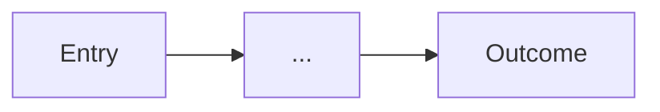

# Design Spec: [Feature Name]

Copy this structure when writing a design spec. Replace bracketed placeholders. Delete instructional comments.

Output path: `docs/design/<feature-slug>.md` (committed, reviewable).

---

## 1. Brief

Copy the full table from [BRIEF-INFERENCE.md](BRIEF-INFERENCE.md), then add **Brief lock** paragraph (1–2 sentences: why this UI exists and what success feels like).

## 1b. Quality bar

Per [QUALITY-BAR.md](QUALITY-BAR.md):

- **Visual reference:** [URL or screenshot] — required for UI specs
- **Craft intent:** [measurable — type scale, surface rhythm, density; not “modern clean”]
- **DNA notes (optional):** [layout family · type roles · colour anchor — borrow, don’t clone]

## 2. Flows

### Primary flow



### Critical paths

- [Path 1 — e.g. happy path checkout]
- [Path 2 — e.g. error recovery]

## 3. Screen inventory

### [Screen name]

| Field | Value                         |
| ----- | ----------------------------- |
| Goal  | [what user accomplishes here] |
| Entry | [how user arrives]            |
| Exit  | [where user goes next]        |

**Content states** (all four required — screen / data):

| State   | User sees | Action available |
| ------- | --------- | ---------------- |
| Loading | ...       | ...              |
| Empty   | ...       | ...              |
| Error   | ...       | ...              |
| Success | ...       | ...              |

**Layout notes** (ASCII wireframe or bullet structure — no full component code):

```
[optional ASCII sketch]
```

<!-- Repeat ### [Screen name] for each screen -->

## 4. Typography & visual system

Per [CSS-INTENT.md](CSS-INTENT.md) — **required for UI**. `/dev` implements this before feature wiring.

| Topic          | Decision                                                     |
| -------------- | ------------------------------------------------------------ |
| Type scale     | [named classes + breakpoint sizes]                           |
| Surface rhythm | [body vs surface sections; border seams]                     |
| Layout shells  | [page-x, max-width per route]                                |
| Grids          | [grid-area / template per breakpoint if bento or asymmetric] |
| Theme          | [dark-first, flash script, tokens]                           |
| globals.css    | [custom classes to add in `@layer components`]               |

## 5. Component map

Map every interactive element to `@polyms/ui-kit` primitives. User should invoke **`/ui-kit`** when unsure of catalog or API.

| UI element    | ui-kit primitive | Variant / notes                            |
| ------------- | ---------------- | ------------------------------------------ |
| [e.g. Submit] | Button           | primary; loading + disabled; focus-visible |
| ...           | ...              | ...                                        |

For primary controls, note **interaction states** the primitive supports (default · hover ·
focus-visible · active · disabled · loading · error · success). Do not invent parallel chrome —
ship what ui-kit exposes. **Content states** (loading/empty/error/success) stay in §3.

**Custom components** (only when ui-kit has no primitive):

| Component | Why custom | Follow-up |
| --------- | ---------- | --------- |
| ...       | ...        | issue/ADR |

## 6. Motion plan

Intent only — implementation details via `/ui-kit` motion API.

| Transition        | Trigger    | Tier (subtle / standard / emphasis) | Reduced motion    |
| ----------------- | ---------- | ----------------------------------- | ----------------- |
| [e.g. panel open] | user click | standard                            | instant/crossfade |

## 7. Responsive and accessibility

| Topic                  | Decision                                 |
| ---------------------- | ---------------------------------------- |
| Breakpoints            | [mobile / tablet / desktop behaviour]    |
| Focus order            | [tab sequence notes]                     |
| ARIA                   | [roles, labels for non-obvious controls] |
| prefers-reduced-motion | [fallback per motion row above]          |

## 8. Visual acceptance for `/dev`

Per [VISUAL-ACCEPTANCE.md](VISUAL-ACCEPTANCE.md) — `/dev` runs [visual-ship.md](../dev/visual-ship.md) before declaring UI done.

## 9. Pre-flight

Run [PREFLIGHT.md](PREFLIGHT.md) — every item must pass before handoff.

## 10. Open questions

- [question 1]

## 11. Anti-slop appendix

Per [ANTI-SLOP.md](ANTI-SLOP.md) — list applicable §A / §A2 rows (apply or N/A + reason) and §B
rules this feature must satisfy. Do not paste the full ban tables.

| ID    | Apply / N/A | Note |
| ----- | ----------- | ---- |
| §A …  |             |      |
| §A2 … |             |      |
| §B …  |             |      |

## Next Step

→ `/dev`

[One line: which skill and why. Prefer `/dev`. Second option only when P0 visual slices need
`/to-issues` first — then list that as an alternative with when, not a `|`-joined menu.]
